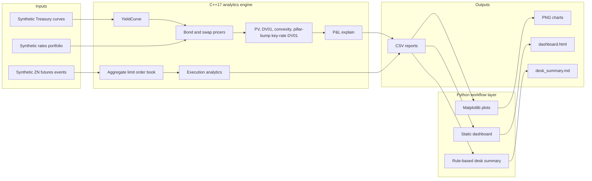

# Fixed Income Desk Quant Platform

This project simulates one working day of a front-office fixed-income desk quant.

The current implementation is **Phase 1**: a deterministic rates desk simulation covering Treasury curve inputs, bond and swap pricing, portfolio risk, P&L explain, synthetic Treasury futures market replay, aggregate order-book analytics, execution metrics, Python plots, a static dashboard, and a rule-based desk summary.

The repository is intentionally structured as a C++17 analytics backend with Python trader-facing workflow tools. It is a portfolio project, not a production valuation library, and the roadmap below separates what is implemented today from what should be added in later phases.

## 1. Project Overview

The demo models a compact desk-day workflow:

| Desk moment | Question | Current Phase 1 response |
|---|---|---|
| Morning risk | What is the book worth after the Treasury curve update? | Load synthetic Treasury zero curves, price Treasury bonds and vanilla swaps, compute PV, DV01, convexity, and pillar-bump key-rate DV01. |
| Intraday market move | What is the P&L impact of Treasury futures moving? | Replay a deterministic synthetic ZN futures event stream, rebuild top-of-book, map futures moves to an approximate 10Y yield shock, and estimate intraday P&L. |
| Hedge execution | How did the hedge order perform? | Simulate a futures execution and calculate arrival, VWAP, TWAP, average fill, slippage, shortfall, execution cost versus VWAP, and fill ratio. |
| End of day | Why did the desk make or lose money? | Generate daily reports, P&L explain, plots, a static dashboard, and a rule-based desk summary. |

All market data and positions are synthetic and versioned in this repository. The demo does not require external market data, paid feeds, or LLM APIs.

## 2. Why This Mimics a Front-Office Fixed-Income Desk Quant

A front-office rates quant often sits between trading decisions, pricing libraries, risk explain, and fast trader-facing tools. This project mirrors that split:

- Pricing and risk logic is implemented in C++ for deterministic analytics and explicit data structures.
- Python handles workflow glue, plotting, dashboarding, and report generation.
- The same run connects curve moves, portfolio risk, P&L attribution, futures market replay, and execution quality.
- Outputs are designed as desk artifacts: CSV risk reports, key-rate exposure, P&L explain, execution analytics, plots, dashboard, and a short desk briefing.

The implementation is intentionally small enough to read in an interview, but broad enough to discuss how pricing, risk, market microstructure, and reporting connect on a fixed-income desk.

## 3. Current Status: Phase 1 Implemented

Phase 1 currently includes:

- Synthetic Treasury zero curves.
- Treasury bond pricing.
- Vanilla swap pricing.
- Portfolio PV.
- DV01 with the convention that positive DV01 gains when rates fall by 1bp.
- Convexity.
- Pillar-bump key-rate DV01.
- Daily first-order rates P&L explain.
- Synthetic Treasury futures market replay.
- Aggregate limit order book.
- Basic execution analytics.
- Python plots.
- Static dashboard.
- Rule-based desk summary.

The following sections and roadmap are honest about scope: corporate credit analytics, stress testing, hedge optimization, market-data validation, pybind11 integration, and AI/RAG credit research are planned future phases, not current features.

## 4. Architecture



Repository layout:

```text
.
|-- CMakeLists.txt
|-- README.md
|-- requirements.txt
|-- include/
|   |-- core/          CSV, date, and utility code
|   |-- rates/         Curve, bond, swap, portfolio, risk, P&L explain
|   `-- execution/     Market events, order book, simulator, execution analytics
|-- src/               C++ implementations
|-- apps/              C++ workflow executables
|-- tests/             CTest-compatible C++ tests
|-- data/              Synthetic input data
|-- python/            Plotting, dashboard, desk summary
|-- scripts/           Build, test, demo, clean wrappers
|-- docs/              Project audit and implementation notes
|-- output/            Generated reports, plots, dashboard, summary
|-- LICENSE
`-- .gitignore
```

### C++ Versus Python Design

C++ is used for:

- Deterministic pricing.
- Risk calculations.
- Scenario-style calculations already present in the portfolio API.
- Order book.
- Execution/TCA.
- Latency-aware components where event ordering and explicit data structures matter.

Python is used for:

- Data workflow.
- Plotting.
- Dashboard.
- Report generation.
- Future ML/RAG.

This mirrors a realistic desk quant architecture: a C++ analytics backend for pricing, risk, order-book, and execution logic, plus Python trader-facing tools for analysis, visualization, reporting, and future research workflows.

## 5. How to Build and Run

Requirements:

- C++17 compiler.
- CMake 3.16 or newer.
- Python 3.9 or newer.
- Python packages in `requirements.txt`.

Install Python dependencies from the repository root:

```bash
python -m pip install -r requirements.txt
```

Build from the repository root:

```bash
./scripts/build.sh
```

Run tests:

```bash
./scripts/run_tests.sh
```

Run the full deterministic demo:

```bash
./scripts/run_full_demo.sh
```

Windows PowerShell:

```powershell
powershell -NoProfile -ExecutionPolicy Bypass -File scripts/run_full_demo.ps1
```

Manual CMake commands from the repository root:

```bash
cmake -S . -B build -DCMAKE_BUILD_TYPE=Release
cmake --build build --config Release
ctest --test-dir build --build-config Release --output-on-failure
```

Equivalent manual demo sequence from the repository root:

```bash
./scripts/build.sh
./scripts/run_tests.sh
./build/run_daily_desk_report .
./build/run_intraday_simulation .
./build/run_full_desk_day .
python python/plot_curves.py .
python python/plot_risk.py .
python python/plot_pnl.py .
python python/plot_execution.py .
python python/generate_desk_summary.py .
python python/dashboard.py --static
```

On multi-config generators such as Visual Studio, executables may be under `build/Release/`. The wrapper scripts search the common build locations.

If a Windows network-share checkout makes local MSBuild builds slow or unreliable, keep the source in place and point the build directory to a local disk:

```bash
FIQ_BUILD_DIR=C:/tmp/fiq-build ./scripts/run_full_demo.sh
```

Interactive dashboard:

```bash
streamlit run python/dashboard.py
```

## 6. Generated Outputs

The full demo writes generated artifacts under `output/`:

- `output/daily_report.csv`
- `output/instrument_pv.csv`
- `output/keyrate_dv01.csv`
- `output/pnl_explain.csv`
- `output/intraday_pnl.csv`
- `output/execution_report.csv`
- `output/desk_summary.md`
- `output/dashboard.html`
- `output/plots/*.png`

Plot outputs include:

| Plot | What it shows |
|---|---|
| `yield_curves.png` | Yesterday versus today synthetic Treasury zero curves. |
| `curve_move_bp.png` | Curve move by maturity in basis points. |
| `instrument_pv.png` | Instrument-level PV by bond/swap. |
| `keyrate_dv01.png` | 2Y, 5Y, 10Y, and 30Y pillar-bump key-rate DV01. |
| `pnl_explain.png` | Full revaluation P&L and approximate first-order attribution components. |
| `intraday_mid_price.png` | Synthetic ZN futures mid-price replay. |
| `intraday_spread.png` | Top-of-book spread through the simulated session. |
| `intraday_pnl.png` | Portfolio P&L linked to futures-implied yield shocks. |
| `execution_report.png` | Slippage, fill ratio, and execution cost metrics. |

Open `output/dashboard.html` after running the demo to inspect the static dashboard.

## 7. Current Limitations

This is an interview-ready simulation, not a production desk system.

- Curves are supplied synthetic zero curves with linear interpolation and flat extrapolation, not bootstrapped Treasury, OIS, or SOFR curves. (In the next Phase I can in principle use treasury bonds from WRDS to draw the curve, but still not like ESTR and OIS risk-free)
- Date handling, calendars, settlement, accrued interest, holidays, and day-count conventions are simplified.
- Key-rate DV01 is a nearest-pillar bump measure, not a production triangular bucket or smooth curve-node sensitivity.
- Swap pricing uses a simplified single-curve framework and par-floating-leg approximation.
- Corporate bond analytics are not implemented yet: no YTM, G-spread, Z-spread, CS01, spread curve, or credit P&L explain.
- P&L explain is a first-order rates explain anchored to full revaluation; carry and convexity are simplified approximations, not a production additive attribution waterfall.
- Scenario analysis and hedge optimization are limited; there is no full stress library or optimizer yet.
- Futures-to-yield mapping is a deterministic approximation for linking electronic market moves to rates P&L.
- The order book is aggregate-depth and order-id aware, but it is not a full exchange matching engine.
- Execution simulation is deterministic and stylized; it does not yet model queue priority, market-order book walking, venue routing, latency distributions, passive versus aggressive choices, or slippage by order size.
- Market data validation is minimal.
- Python calls the generated CSV outputs rather than directly calling the C++ engine through pybind11.
- All positions and market data are synthetic.

## 8. Roadmap

### Phase 2: Corporate Bond Credit Analytics
- Data Source: WRDS TRACE
- YTM.
- G-spread.
- Z-spread.
- CS01.
- Corporate spread curve.
- Rates versus spread P&L explain.
- Rich/cheap signal.

### Phase 3: Scenario Analysis, Stress Testing, and Hedge Optimizer

- Parallel rate shocks.
- Steepener/flattener.
- Belly shock.
- Credit spread widening.
- Combined rates plus credit stress.
- Hedge optimizer using Treasury futures or swaps.
- Pre/post hedge key-rate DV01.

### Phase 4: Market Data Validation and Enhanced TCA

- Curve validation.
- Price/spread outlier checks.
- Crossed-market detection.
- Slippage by order size.
- Market order walking the book.
- Passive versus aggressive execution.
- Latency summary.

### Phase 5: C++/Python Integration

- pybind11 bindings.
- Python dashboard directly calling C++ engine.
- Keep C++ for pricing/risk/order-book/TCA.
- Keep Python for workflow, visualization, ML, RAG, and reporting.

### Phase 6: AI Credit Research Assistant

- RAG over annual reports, 10-Ks, and credit documents.
- Retrieve evidence about leverage, liquidity, refinancing risk, debt maturity, interest expense, and risk factors.
- Extract hard financial features.
- Predict fair Z-spread or spread change using transparent ML/statistical models.
- Compare predicted fair spread with market spread.
- Generate evidence-backed credit memo.
- Use LLM/RAG for explanation and evidence retrieval, not as the sole numerical prediction engine.
