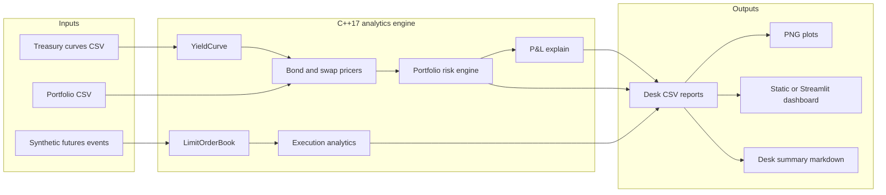

# Fixed Income Desk Quant Platform

**Pricing, Risk, P&L Explain, Execution Analytics, and Desk Reporting**

This project simulates one working day of a front-office fixed-income desk quant supporting both **voice trading** and **electronic trading** workflows. It is designed as a serious quant finance portfolio project: C++ owns the pricing, risk, market replay, order-book, and execution analytics engine; Python owns visualization, dashboarding, and desk-summary generation.

The data is synthetic but deliberately shaped like real desk inputs: Treasury zero curves, a Treasury bond and vanilla swap portfolio, Treasury futures order-book events, hedge execution fills, and end-of-day desk reports. No proprietary data, paid feeds, or external LLM APIs are required.

## Desk-Day Story

The repo is organized around a realistic rates desk support cycle.

| Time of day | Desk question | System response |
|---|---|---|
| Morning | What is the portfolio worth after the curve update? | Load yesterday/today Treasury curves, validate inputs, price bonds and swaps, compute PV, DV01, convexity, and key-rate DV01. |
| Midday | What is the P&L impact of the futures market moving? | Replay synthetic ZN futures events, reconstruct top-of-book, map futures moves into yield shocks, and estimate intraday portfolio P&L. |
| Hedge execution | How did our hedge order perform? | Simulate a futures hedge execution and compute arrival, VWAP, TWAP, average fill, slippage, shortfall, and fill ratio. |
| End of day | Why did we make or lose money? | Attribute daily P&L to rates, curve shape, convexity, carry approximation, and residual; generate CSVs, plots, dashboard, and a desk summary. |

## Architecture



Repository layout:

```text
fixed-income-desk-quant-platform/
|-- include/
|   |-- core/          CSV, date, and utility code
|   |-- rates/         Curve, bond, swap, portfolio, risk, P&L explain
|   `-- execution/     Market events, order book, simulator, execution analytics
|-- src/               C++ implementations
|-- apps/              C++ workflow executables
|-- tests/             CTest-compatible C++ tests
|-- data/              Synthetic input data
|-- python/            Plotting, dashboard, desk summary
|-- scripts/           Build, test, demo, clean wrappers
`-- output/            Generated reports, plots, dashboard, summary
```

## Pricing And Risk Workflow

The morning rates workflow is implemented in C++ and starts with two curve files:

- `data/curves/curve_yesterday.csv`
- `data/curves/curve_today.csv`

`rates::YieldCurve` validates the curve, applies linear interpolation, uses flat extrapolation outside the pillar range, and computes continuously compounded discount factors. The demo portfolio is loaded from `data/portfolio/portfolio.csv` and contains synthetic Treasury bonds and vanilla interest-rate swaps.

Pricing and risk components:

| Component | Role |
|---|---|
| `rates::FixedRateBond` | Generates simplified coupon/principal cashflows, prices with discount factors, computes PV, DV01, convexity, and yield-to-maturity. |
| `rates::VanillaSwap` | Prices fixed leg versus a simplified par-floating leg, computes par rate, NPV, DV01, and key-rate DV01. |
| `rates::Portfolio` | Aggregates bonds and swaps, exports instrument-level PV, total PV, total DV01, convexity, scenario P&L, and key-rate DV01. |
| `rates::PnLExplain` | Computes full revaluation P&L and attributes it to key-rate moves, parallel-rate move, curve twist/slope, convexity, carry approximation, and residual. |

DV01 convention: positive DV01 means the position gains value when rates fall by 1bp. A rate move of `+x` bp contributes approximately `-DV01 * x` to P&L.

## Voice Trading Workflow

This branch of the project models the kind of support a desk quant provides to traders and salespeople during voice-driven rates markets.

1. The desk receives updated Treasury curve marks.
2. The C++ engine reprices the book and produces PV/risk reports.
3. Key-rate DV01 identifies the maturity bucket driving risk.
4. P&L explain separates broad rate selloff/rally effects from curve-shape effects and residual.
5. The generated desk summary turns the numbers into a concise briefing suitable for a morning or close-of-day desk conversation.

Example trader-facing outputs:

| Report | Purpose |
|---|---|
| `output/daily_report.csv` | One-line desk snapshot: PV, P&L, total DV01, largest key-rate risk, suggested hedge. |
| `output/instrument_pv.csv` | Bond/swap level PV, P&L, DV01, convexity. |
| `output/keyrate_dv01.csv` | 2Y, 5Y, 10Y, and 30Y key-rate exposure. |
| `output/pnl_explain.csv` | Full revaluation P&L and attribution components. |

## Electronic Trading Workflow

The electronic workflow connects market microstructure to portfolio risk.

1. `execution::MarketDataSimulator` generates deterministic ZN futures ADD, CANCEL, and TRADE events using a fixed random seed.
2. `execution::LimitOrderBook` reconstructs aggregate depth by price level and exposes best bid, best ask, mid, spread, and top-of-book depth.
3. Futures mid-price moves are converted into approximate 10Y yield shocks.
4. The 10Y key-rate DV01 links the futures-implied shock to intraday portfolio P&L.
5. `execution::ExecutionSimulator` simulates a hedge order.
6. `execution::ExecutionAnalytics` computes VWAP, TWAP, arrival price, average fill, slippage, implementation shortfall, execution cost versus VWAP, and fill ratio.

Example electronic outputs:

| Report | Purpose |
|---|---|
| `data/market_events/simulated_ticks.csv` | Deterministic synthetic futures event stream. |
| `output/intraday_pnl.csv` | Futures mid, spread, depth, yield shock, and linked portfolio P&L through the day. |
| `output/execution_report.csv` | Execution quality metrics for the simulated hedge order. |

## C++ Versus Python Design Choices

The project intentionally separates the low-level analytics layer from the reporting layer.

| Layer | Technology | Why |
|---|---|---|
| Pricing and risk engine | C++17 | Deterministic numerical code, explicit data structures, interview-relevant performance awareness, and clean separation of headers/implementations. |
| Order book and execution analytics | C++17 | Event-driven processing and top-of-book reconstruction mirror latency-aware electronic trading components. |
| Tests | CTest-compatible C++ harness, optional Catch2 | Works offline by default, while still supporting a standard test framework when network access is available. |
| Visualization and reporting | Python, pandas, matplotlib, optional Streamlit | Fast iteration for desk plots, CSV inspection, dashboarding, and rule-based natural-language reporting. |

## Determinism And Reproducibility

The full demo is designed to be deterministic from a fresh clone:

- Synthetic market data uses a fixed seed: `MarketDataSimulator(42)`.
- Input curves and portfolio positions are versioned CSV files.
- C++ CSV exports use fixed decimal formatting and stable row ordering.
- `scripts/run_full_demo.sh` removes generated CSV, Markdown, dashboard, and PNG files before each run.
- Python reporting runs with `PYTHONHASHSEED=0`.
- Plot scripts write PNGs without run-date metadata.
- No external market data or LLM API calls are used.

## Example Output Tables

Representative `output/daily_report.csv` shape:

| metric | value |
|---|---:|
| pv_yesterday | 176234512.38 |
| pv_today | 175812044.19 |
| daily_pnl | -422468.19 |
| total_dv01 | 81234.55 |
| largest_keyrate_risk | 5Y:45612.11 |
| suggested_hedge | reduce_5Y_duration_with_payer_swap_or_futures |

Representative `output/keyrate_dv01.csv` shape:

| key_maturity | dv01 |
|---:|---:|
| 2 | 12984.42 |
| 5 | 45612.11 |
| 10 | 31540.73 |
| 30 | 1097.29 |

Representative `output/execution_report.csv` shape:

| metric | value |
|---|---:|
| arrival_price | 110.000000 |
| average_fill_price | 109.984375 |
| vwap | 109.991241 |
| twap | 109.993102 |
| slippage_ticks | 1.0000 |
| implementation_shortfall | 7812.50 |
| fill_ratio | 1.0000 |

Values above illustrate report format; exact numbers are generated by the deterministic demo on the local toolchain.

## Generated Reports

The full demo writes:

- `output/daily_report.csv`
- `output/instrument_pv.csv`
- `output/keyrate_dv01.csv`
- `output/pnl_explain.csv`
- `output/intraday_pnl.csv`
- `output/execution_report.csv`
- `output/desk_summary.md`
- `output/dashboard.html`
- `output/plots/*.png`

## Screenshots And Plot References

After running the full demo, the plot gallery is available in `output/plots/`:

| Plot | What it shows |
|---|---|
| `yield_curves.png` | Yesterday versus today Treasury zero curves. |
| `curve_move_bp.png` | Curve move by maturity in basis points. |
| `instrument_pv.png` | Instrument-level PV by bond/swap. |
| `keyrate_dv01.png` | 2Y, 5Y, 10Y, 30Y key-rate DV01. |
| `pnl_explain.png` | Full revaluation P&L and attribution components. |
| `intraday_mid_price.png` | Synthetic ZN futures mid-price replay. |
| `intraday_spread.png` | Top-of-book spread through the simulated session. |
| `intraday_pnl.png` | Portfolio P&L linked to futures-implied yield shocks. |
| `execution_report.png` | Slippage, fill ratio, and execution cost metrics. |

Open `output/dashboard.html` for a static dashboard, or run Streamlit for an interactive view.

## How To Build

Requirements:

- C++17 compiler
- CMake 3.16+
- Python 3.9+
- Python packages in `requirements.txt`

Install Python dependencies:

```bash
python -m pip install -r requirements.txt
```

Build:

```bash
cd fixed-income-desk-quant-platform
./scripts/build.sh
```

Manual CMake commands:

```bash
cmake -S . -B build -DCMAKE_BUILD_TYPE=Release
cmake --build build --config Release
```

Tests default to an offline CTest-compatible harness. To use Catch2 through CMake FetchContent:

```bash
cmake -S . -B build -DCMAKE_BUILD_TYPE=Release -DFIQ_USE_CATCH2=ON
cmake --build build --config Release
ctest --test-dir build --build-config Release --output-on-failure
```

## How To Run The Demo

Full demo:

```bash
./scripts/run_full_demo.sh
```

Windows PowerShell:

```powershell
powershell -NoProfile -ExecutionPolicy Bypass -File scripts/run_full_demo.ps1
```

Equivalent manual sequence:

```bash
./scripts/build.sh
./scripts/run_tests.sh
./build/run_daily_desk_report .
./build/run_intraday_simulation .
./build/run_full_desk_day .
python python/plot_curves.py .
python python/plot_risk.py .
python python/plot_pnl.py .
python python/plot_execution.py .
python python/generate_desk_summary.py .
python python/dashboard.py --static
```

Interactive dashboard:

```bash
streamlit run python/dashboard.py
```

## Tests

The C++ tests cover:

- Yield-curve interpolation, extrapolation, and validation.
- Discount factor monotonicity.
- Bond pricing, rate sensitivity, and DV01 sign.
- Swap par-rate and payer-swap DV01 behavior.
- Portfolio PV aggregation and key-rate DV01 shape.
- Order-book best bid/ask updates, cancels, and trades.
- Execution VWAP, TWAP, slippage, and fill ratio.

Run:

```bash
./scripts/run_tests.sh
```

## Limitations

This is an interview-ready simulation, not a production valuation library.

- Curve construction uses supplied zero rates and linear interpolation, not full Treasury or SOFR bootstrapping.
- Date handling, calendars, settlement, accrued interest, and day-count conventions are simplified.
- The swap floating leg uses a par-floater approximation in version 1.
- Futures-to-yield mapping is a deterministic approximation for linking electronic markets to portfolio P&L.
- The order book is aggregate-depth and order-id aware, but not a full exchange matching engine.
- Execution simulation is deterministic and stylized; it does not model queue priority, venue routing, latency, or partial hidden liquidity.
- All positions and market data are synthetic.

## Future Extensions

High-value extensions for a deeper desk-quant discussion:

- SOFR OIS bootstrapping and multi-curve swap pricing.
- Treasury cash/futures basis and CTD analytics.
- QuantLib comparison tests for bonds, swaps, and curve scenarios.
- `pybind11` bindings so Python dashboards can call the C++ engine directly.
- Real-time market replay dashboard with incremental order-book snapshots.
- More realistic execution model with queue position, child-order scheduling, and latency assumptions.
- Historical Treasury auction and Federal Reserve data ingestion.
- Natural-language query layer over generated risk, P&L, and execution reports.
